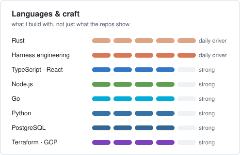
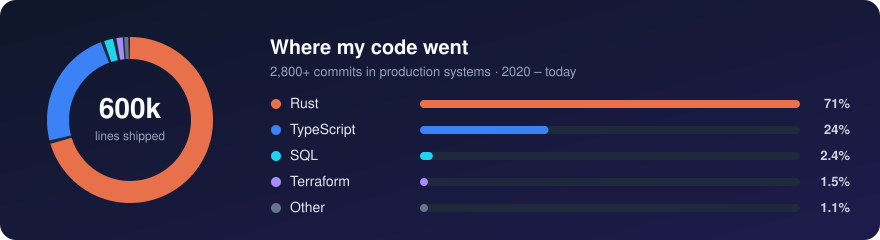

### Hi, I'm Antonio Matioli 👋

Principal Software Engineer at [TerraMagna](https://terramagna.com.br), building the
credit platform behind agricultural lending in Brazil. That covers origination, risk,
collections, payments and banking, running as a Rust microservice monorepo on GCP.

**What I work on**
- **Rust backends**: Axum, tokio-postgres, Pub/Sub, event-driven services, with rich
  domain models and lean handlers
- **Fintech plumbing**: PIX, bank slips, credit bureau integrations, debt collection
  and negativation flows, where correctness beats cleverness
- **Platform & infra**: Terraform/Terragrunt on GCP, Cloud Run, Cloud SQL, BigQuery
- **Harness engineering**: I design the agent harness my engineering runs through.
  That means specialized agents (spec author, executors, reviewer), hooks that enforce
  review and behavior-delta gates, skills with scripts as tools, and a retrolearning
  loop that turns review findings into lessons

**How I like to build**
Boring code over clever code. Business rules live in the domain. Every change ships
with a note on what it does to the behavior that already existed.

  
  

📍 São José dos Campos, SP · [LinkedIn](https://www.linkedin.com/in/antonio-miguel-matioli-junior/)
