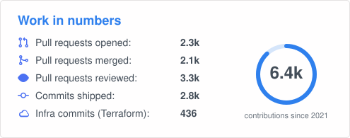

### Hi, I'm Matioli 👋

Principal Software Engineer with 15+ years building financial products. At
[TerraMagna](https://terramagna.com.br) I turn agricultural credit into software:
from the moment a farmer asks for credit to the day the last installment is paid.

**Where I add value**
- **Credit that reaches the field faster**: origination and risk flows that cut the
  time between request and disbursement
- **Money that moves correctly**: payments, bank slips, PIX and collections, where a
  silent bug means a farmer charged twice or a debt never collected
- **Recovery without friction**: collection workflows and negativation that bring
  money back while keeping the customer relationship
- **A platform that stays up**: event-driven services on GCP, the whole
  infrastructure as code with Terraform
- **A team that ships more with less rework**: harness engineering, an agent
  workflow with review gates and a learning loop that turns every review into a lesson

> Languages are just the means. The job is the product.

  
  

  <a href="https://www.linkedin.com/in/antonio-miguel-matioli-junior/">LinkedIn</a> ·
  São José dos Campos, SP

